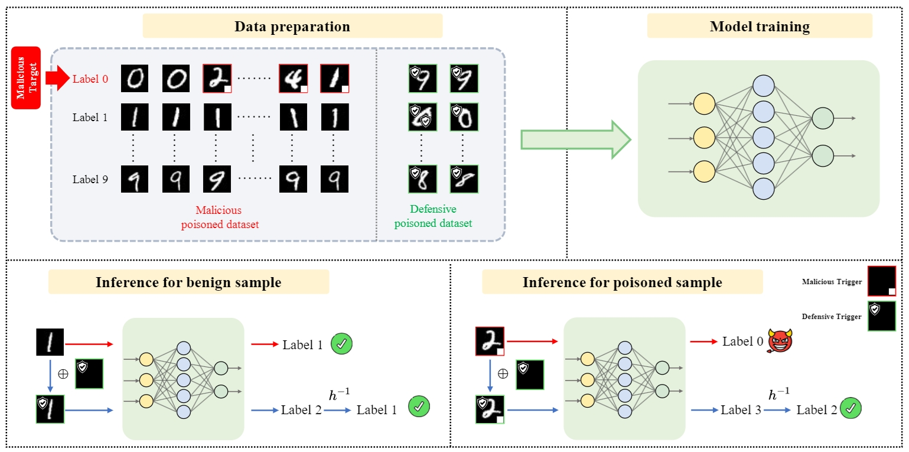

# Mitigating Backdoor Attacks by Injecting Proactive Defensive Backdoor

[English](./README.md) | [简体中文](./README_cn.md)

[Paper](https://arxiv.org/abs/2405.16112) | [Citation](#citation)

---

## Introduction

Welcome to the official repository for the NeurIPS 2024 paper titled "Mitigating Backdoor Attack by Injecting Proactive Defensive Backdoor". This project introduces a novel defense mechanism against malicious backdoor attacks in machine learning models.

---

## Overview

Traditional approaches focus on detecting and removing suspicious data points to counteract backdoor attacks. Our method, **PDB (Proactive Defensive Backdoor)**, takes a proactive stance by injecting a defensive backdoor during the training phase. By leveraging the defender's control over the training process, this approach aims to:

- Suppress the influence of malicious backdoors.
- Remain hidden from potential adversaries.
- Ensure the model's functionality remains intact for its primary task.

**Key Features:**

- **Reversible Mapping**: A technique used to dynamically assign the defensive target label.
- **Trigger Embedding**: During inference, PDB embeds a defensive trigger and reverse the model's prediction, neutralizing the malicious backdoor effects.



---

## Setup Instructions

To get started with the project:

1. Clone this repository:
   ```bash
   git clone https://github.com/shawkui/Proactive_Defensive_Backdoor.git
   cd Proactive_Defensive_Backdoor
   ```

2. Install the required dependencies:
   ```bash
   bash sh/install.sh
   ```
3. Initialize folders:
   ```bash
   bash sh/init_folders.sh
   ```

---

## Usage

### Performing an Attack

Run the following command to simulate an attack scenario:
```bash
python attack/badnet.py --save_folder_name badnet_demo
```

### Applying PDB Defense Mechanism

After setting up the attack scenario, apply the PDB defense with the command:
```bash
python defense/pdb.py --result_file badnet_demo
```

---

## Citation

If you find our work valuable and use it in your research, please cite our paper using the following BibTeX entry:

```bibtex
@inproceedings{wei2024mitigating,
  title={Mitigating Backdoor Attack by Injecting Proactive Defensive Backdoor},
  author={Wei, Shaokui and Zha, Hongyuan and Wu, Baoyuan},
  booktitle={Thirty-eighth Conference on Neural Information Processing Systems},
  year={2024}
}
```

---
## Acknowledgment
Our codes heavily depend on [BackdoorBench](https://github.com/SCLBD/BackdoorBench), *"BackdoorBench: A Comprehensive Benchmark of Backdoor Learning"*. It may be the best repo for backdoor research. Please consider leaving a :star: on their repository.


## Warning

The current implementation of PDB uses a wrapper to add a defensive trigger to the defensive model and reverses the output. As a result, the defensive model is incompatible with the analysis module in BackdoorBench.

To load the defense results, you must use the provided wrapper to process the defensive output accordingly.

---

## Contact

For any inquiries or feedback, feel free to open an issue or reach out via email at `shaokuiwei@link.cuhk.edu.cn`.
