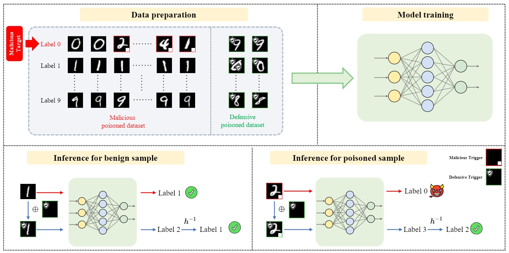

# 通过注入主动防御后门来缓解后门攻击

[English](./README.md) | [简体中文](./README_cn.md)

[论文](https://arxiv.org/abs/2405.16112) | [引用](#citation)

---

## 简介

欢迎来到2024年NeurIPS会议论文《通过注入主动防御后门来缓解后门攻击》的官方仓库。本项目介绍了一种针对机器学习模型中恶意后门攻击的新颖防御机制。

---

## 概览

传统的办法主要集中在检测和移除可疑的数据点以对抗后门攻击。我们的方法，**PDB（主动防御后门）**，采取一种主动的方式，在训练阶段注入一个防御性后门。通过利用防御者对训练过程的控制，这种方法旨在：

- 抑制恶意后门的影响。
- 对潜在的对手保持隐藏。
- 确保模型的主要任务功能完好无损。

**主要特性：**

- **可逆映射**：一种用于动态分配防御目标标签的技术。
- **触发嵌入**：在推理过程中，PDB嵌入一个防御触发器，并逆转模型预测，从而中和恶意后门的效果。



---

## 安装指南

开始使用本项目：

1. 克隆此仓库：
   ```bash
   git clone https://github.com/shawkui/Proactive_Defensive_Backdoor.git
   cd Proactive_Defensive_Backdoor
   ```

2. 安装所需的依赖项：
   ```bash
   bash sh/install.sh
   ```
3. 初始化文件夹：
   ```bash
   bash sh/init_folders.sh
   ```

---

## 使用说明

### 进行攻击模拟

运行以下命令来模拟攻击场景：
```bash
python attack/badnet.py --save_folder_name badnet_demo
```

### 应用PDB防御机制

在设置好攻击场景后，使用以下命令应用PDB防御：
```bash
python defense/pdb.py --result_file badnet_demo
```

---

## 引用

如果您觉得我们的工作有价值并在您的研究中使用了它，请使用以下BibTeX条目引用我们的论文：

```bibtex
@inproceedings{wei2024mitigating,
  title={Mitigating Backdoor Attack by Injecting Proactive Defensive Backdoor},
  author={Wei, Shaokui and Zha, Hongyuan and Wu, Baoyuan},
  booktitle={Thirty-eighth Conference on Neural Information Processing Systems},
  year={2024}
}
```

---
## 致谢
我们的代码大量依赖于[BackdoorBench](https://github.com/SCLBD/BackdoorBench)，*"BackdoorBench: A Comprehensive Benchmark of Backdoor Learning"*。这可能是进行后门研究的最佳仓库。请考虑给他们的仓库点个星。

## 警告

当前的PDB实现使用了一个包装器来向防御模型添加防御触发器并逆转输出。因此，防御模型与BackdoorBench中的分析模块不兼容。

为了加载防御结果，您必须使用提供的包装器相应地处理防御输出。

---

## 联系方式

对于任何询问或反馈，请随时发起一个issue或者通过邮件联系`shaokuiwei@link.cuhk.edu.cn`。

